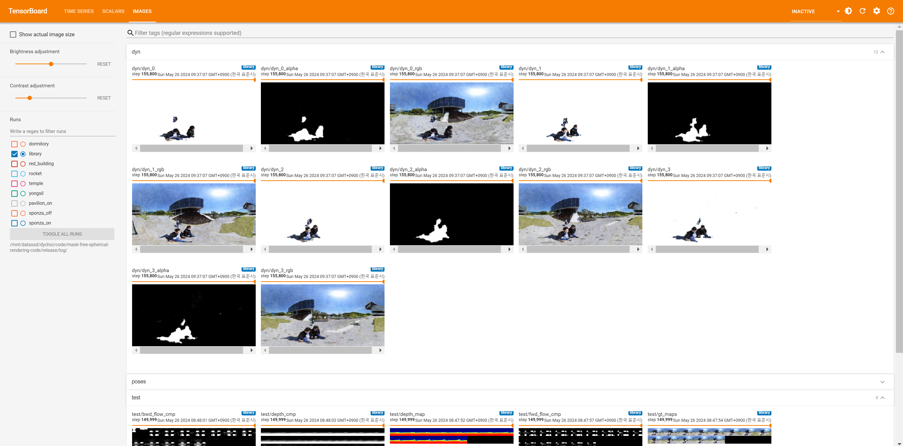

# OmniLocalRF: Omnidirectional Local Radiance Fields from Dynamic Videos

Omnidirectional cameras are extensively used in various applications to provide a wide field of vision. However, they face a challenge in synthesizing novel views due to the inevitable presence of dynamic objects, including the photographer, in their wide field of view. In this paper, we introduce a new approach called Omnidirectional Local Radiance Fields (OmniLocalRF) that can render static-only scene views, removing and inpainting dynamic objects simultaneously. Our approach combines the principles of local radiance fields with the bidirectional optimization of omnidirectional rays. Our input is an omnidirectional video, and we evaluate the mutual observations of the entire angle between the previous and current frames. To reduce ghosting artifacts of dynamic objects and inpaint occlusions, we devise a multi-resolution motion mask prediction module. Unlike existing methods that primarily separate dynamic components through the temporal domain, our method uses multi-resolution neural feature planes for precise segmentation, which is more suitable for long 360 videos. Our experiments validate that OmniLocalRF outperforms existing methods in both qualitative and quantitative metrics, especially in scenarios with complex real-world scenes. In particular, our approach eliminates the need for manual interaction, such as drawing motion masks by hand and additional pose estimation, making it a highly effective and efficient solution.

### [Project page](https://vclab.kaist.ac.kr/cvpr2024p1) | [Paper](https://vclab.kaist.ac.kr/cvpr2024p1/OmniLocalRF.pdf) | [Data](https://)
[Dongyoung Choi](https://vclab.kaist.ac.kr/dychoi), 
[Hyeonjoong Jang](https://sites.google.com/view/hyeonjoong), 
[Min H. Kim](http://vclab.kaist.ac.kr/minhkim)

#### Input 360 videos

#### View synthesis results


## Setup
Tested with Pytorch 2.3.0 and CUDA 11.6 compute platforms.
```
git clone --recursive https://github.com/KAIST-VCLAB/OmniLocalRF && cd OmniLocalRF
conda create -n omnilocalrf python=3.8 -y
conda activate omnilocalrf
pip install torch torchvision # Replace here with the command from https://pytorch.org/ corresponding to your compute platform
pip install tqdm scikit-image opencv-python configargparse lpips imageio-ffmpeg kornia lpips tensorboard imageio easydict matplotlib scipy==1.6.1 plyfile joblib timm
```

## Preprocessing
Download the [real and synthetic 360 scenes](https://).

We use [RAFT](https://github.com/princeton-vl/RAFT) and [DPT](https://github.com/isl-org/DPT) for flow and monocular depth prior.

Get pretrained weights.
```
bash scripts/download_weights.sh
```

Run flow and depth estimation (assuming sorted image files in `${SCENE_DIR}/images`). We use `${frame_step}` 4 in real dataset and 1 for synthetic dataset.
```
python scripts/run_flow.py --data_dir ${SCENE_DIR} --frame_step ${frame_step}
python DPT/run_monodepth.py --input_path ${SCENE_DIR}/images --output_path ${SCENE_DIR}/depth --model_type dpt_large
```

Alternatively, run `scripts/preprocess_real.sh` and `scripts/preprocess_syn.sh` to preprocess all real and synthetic scenes respectively.
```
bash scripts/preprocess_real.sh
bash scripts/preprocess_syn.sh
```


## Optimization
We can trian the model by parsing the config file in `config` folder. Please set the data and log directory `datadir, logdir` in the config file for training.
```
python src/train.py --config ${CONFIG_FILE}
```
For example, we can train the `Yongsil` scene in the real dataset by `python src/train.py --config config/real/yongsil.txt`. After training completion, test views and smoothed trajectories will be stored in `logdir`. 

Since we progressively optimize the radiance field blocks and increase the number of iterations with each block insertion, we cannot estimate the total number of iterations during training. However, it takes about 150K iterations for each dataset

## Visualization
We can see the intermediate results during training by tensorboard.
```
tensorboard --logdir ${LOG_DIR}
```


## Citation
```
@InProceedings{Choi_2024_CVPR,
   author = {Dongyoung Choi and Hyeonjoong Jang and Min H. Kim},
   title = {OmniLocalRF: Omnidirectional Local Radiance Fields from Dynamic Videos},
   booktitle = {CVPR},
   month = {June},
   year = {2024}
} 
```

## Acknowledgements
The code is implemented based on the [LocalRF](https://github.com/facebookresearch/localrf) and is available under the MIT license. It also incorporates elements from [TensoRF](https://github.com/apchenstu/TensoRF) and [DynamicNeRF](https://github.com/gaochen315/DynamicNeRF), both of which are licensed under the MIT license.
Licenses for these projects can be found in the `licenses/` folder.

We use [RAFT](https://github.com/princeton-vl/RAFT) and [DPT](https://github.com/isl-org/DPT) for flow and monocular depth prior.